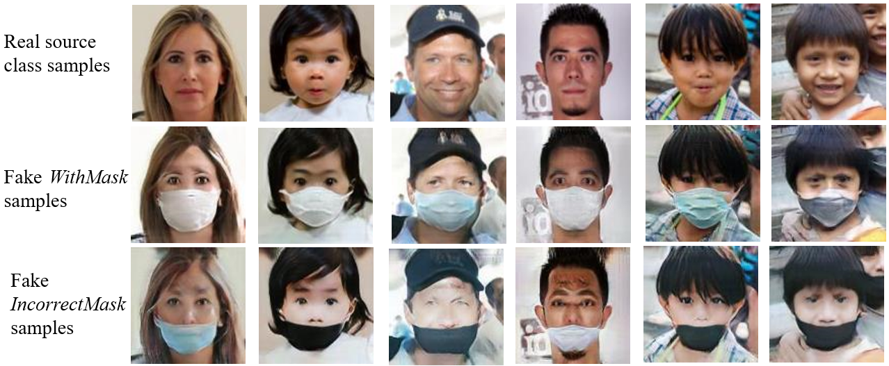

# GDAM-GAN
GDAM-GAN is a generic data augmentation method that uses GAN models to generate new images of a specific class

## General description
GDAM-GAN can be used in applications that meet the following criteria:
- There is a sample set of a target class, i.e. the desired class of which we want to create more instances. These samples are represented as <i><b>x</b>t</i> and the target class is <i>lt</i>
- There is a class that shares some features with the target class <i>lt</i>, we refer to this as the source class <i>ls</i>. 
- There are considerably more samples of the source class than the target class, |<i><b>x</b>s</i>|>>|<i><b>x</b>t</i>| 

The method consists of three main stages:
1) Source class generative model. Its purpose is to create artificial samples of the source class.
2) Image-to-image translation model. Its purpose is to transform samples from the source class to the target class.
3) Fake sample analysis and data cleaning. Its purpose is to select useful fake samples in a semi-automated way.  

The idea is to combine the specific features of the target class with the variety of the source class to create new unseen samples that might be used to build fake-datasets and potentially improve the training of data-driven models. 

## Fake data generation
This method has been used for the following applications:
### Mask usage classification
There are usually three classes in this problem: <i>WithoutMask</i>, which refers to a face that isn't wearing any sort of mask; <i>WithMask</i>, a face wearing a mask correctly; and <i>IncorrectMask</i>, when the mask isn't worn correctly, i.e. with the nose and/or mouth uncovered.
In most datasets, the class <i>IncorrectMask</i> has significantly fewer samples with respect to the other two classes.
GDAM-GAN was implemented to create fake samples of <i>IncorrectMask</i>.
Additionally, for demonstrative purposes, the method was also applied in the generation of fake samples of the <i>WithMask</i> class.
In both cases, the source class was <i>WithoutMask</i> (or just _Faces_ for simplicity). Some results are shown below:

### Tomato disease classification
In this application, GDAM-GAN was implemented to create fake samples of four different tomato leaf diseases (target classes) from healthy tomato leaves samples (source class). Some results are shown below:

### Leukocyte classification
GDAM-GAN was implemented to create fake samples of monocytes and neutrophils (target classes), using samples of lymphocytes as the source class. Some results are shown below:

## Implementation details
This is a research project developed in Chihuahua Institute of Technology (Tecnológico Nacional de México Campus Chihuahua), and unfortunately there are some restrictions on sharing the implementation details. If you are interested in knowing more about this project, please see the contact section below. 

## Contact
Jesus Alejandro Navarro Acosta. Student of Master of science in the area of digital signal processing.
Email: jesus1112.jn@gmail.com

[Mario I. Chacón-Murguía Ph.D.](https://ieeexplore.ieee.org/author/38289074200). Senior IEEE member and Research Professor with Chihuahua Institute of Technology
Email: mchacon@ieee.org

